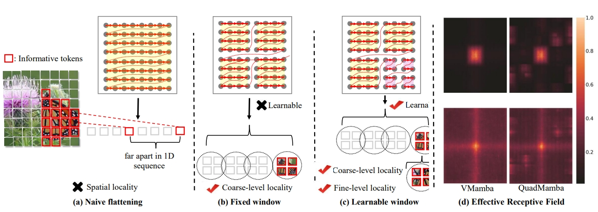
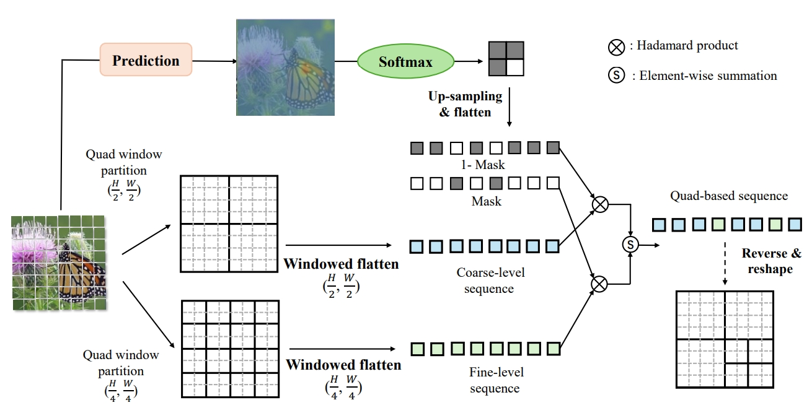

# QuadMamba: Learning Quadtree-based Selective Scan for Visual State Space Model

#### If you have any questions, please don't hesitate to contact me. (jaffe031@sjtu.edu.cn)

- [x] 2024.10 QuadMamba is accepted by NeurIPS. 
- [x] 2024.11 Release the raw code of QuadMamba. 
- [x] 2025.06 Fixed the bugs in the code. 
- [ ] 2025.06 Improve the QuadMamba scheme. 


## Introduction of QuadMamba

<p align="center">

</p>
Recent advancements in State Space Models, notably Mamba, have demonstrated superior performance over the dominant Transformer models, particularly in reducing the computational complexity from quadratic to linear. Yet, difficulties in
adapting Mamba from language to vision tasks arise due to the distinct characteristics of visual data, such as the spatial locality and adjacency within images and large variations in information granularity across visual tokens. Existing
vision Mamba approaches either flatten tokens into sequences in a raster scan fashion, which breaks the local adjacency of images, or manually partition tokens into windows, which limits their long-range modeling and generalization capabilities. To address these limitations, we present a new vision Mamba model, coined QuadMamba, that effectively captures local dependencies of varying granularities via quadtree-based image partition and scan. Concretely, our lightweight quadtree-based scan module learns to preserve the 2D locality of spatial regions within learned window quadrants. The module estimates the locality score of each token from their features, before adaptively partitioning tokens into window quadrants. An omnidirectional window shifting scheme is also introduced to capture more intact and informative features across different local regions. To make the discretized quadtree partition end-to-end trainable, we further devise a sequence masking strategy based on Gumbel-Softmax and its straight-through gradient estimator.

<p align="center">

</p>

Quadtree-based selective scan with prediction modules. Image tokens are partitioned into
bi-level window quadrants from coarse to fine. A fully differentiable partition mask is then applied to
generate the 1D sequence with negligible computational overhead.

## Getting Started

### Installation

QuadMamba is based on the old version of VMamba; The installation can be referred to [VMamba](https://github.com/MzeroMiko/VMamba/tree/main). 

**Environment Setup:**

VMamba recommends setting up a conda environment and installing dependencies via pip. Use the following commands to set up your environment:
Also, We recommend using the pytorch>=2.0, cuda>=11.8. But lower version of pytorch and CUDA are also supported.

***Create and activate a new conda environment***

```bash
conda create -n quadmamba
conda activate quadmamba
```

***Install Dependencies***

```bash
pip install -r requirements.txt
cd kernels/selective_scan && pip install .
```
<!-- cd kernels/cross_scan && pip install . -->


***Dependencies for `Detection` and `Segmentation` (optional)***

```bash
pip install mmengine==0.10.1 mmcv==2.1.0 opencv-python-headless ftfy regex
pip install mmdet==3.3.0 mmsegmentation==1.2.2 mmpretrain==1.2.0
```

### Model Training and Inference

**Classification**

To train QuadMamba models for classification on ImageNet, use the following commands for different configurations:

```bash
python -m torch.distributed.launch --nnodes=1 --node_rank=0 --nproc_per_node=8 --master_addr="127.0.0.1" --master_port=29501 main.py --cfg </path/to/config> --batch-size 128 --data-path </path/of/dataset> --output /tmp
```

If you only want to test the performance (together with params and flops):

```bash
python -m torch.distributed.launch --nnodes=1 --node_rank=0 --nproc_per_node=1 --master_addr="127.0.0.1" --master_port=29501 main.py --cfg </path/to/config> --batch-size 128 --data-path </path/of/dataset> --output /tmp --pretrained </path/of/checkpoint>
```


To train with `mmdetection` or `mmsegmentation`:
```bash
bash ./tools/dist_train.sh </path/to/config> 8
```

## Citation

If you find it useful, please consider to cite the paper, thanks!

```

@article{xie2024quadmamba,
    title={QuadMamba: Learning Quadtree-based Selective Scan for Visual State Space Model},
    author={Xie, Fei and Zhang, Weijia and Wang, Zhongdao and Ma, Chao},
    journal={Advances in Neural Information Processing Systems},
    year={2024}
}

```

## Acknowledgment

This project is based on [VMamba](https://github.com/MzeroMiko/VMamba/tree/main) (Visual State Space Model, NeurIPS2024), [LocalMamba](https://arxiv.org/pdf/2403.09338), and [DynamicViT](https://arxiv.org/abs/2106.02034). Thanks for their great work!
